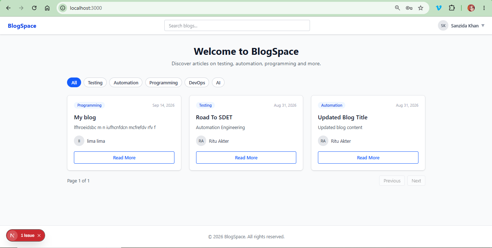
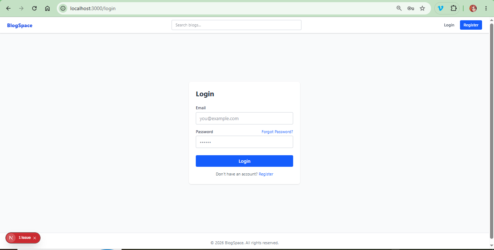
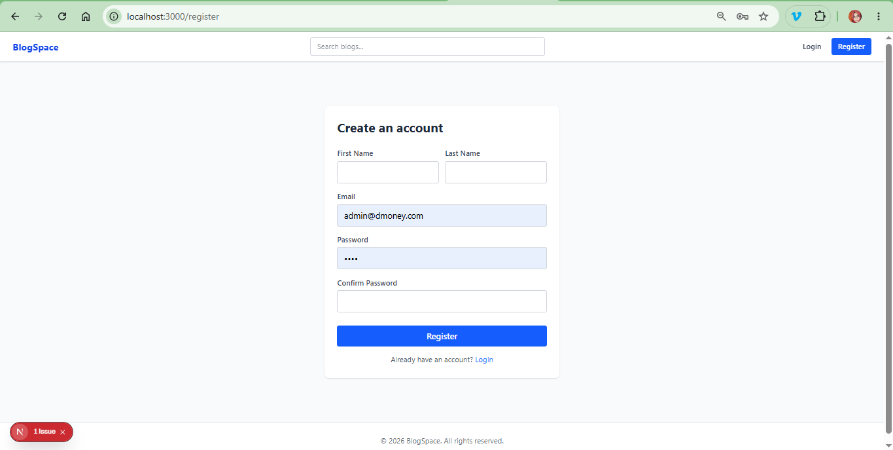
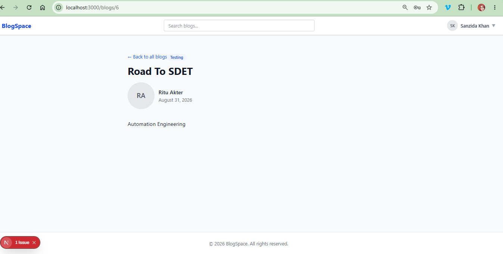
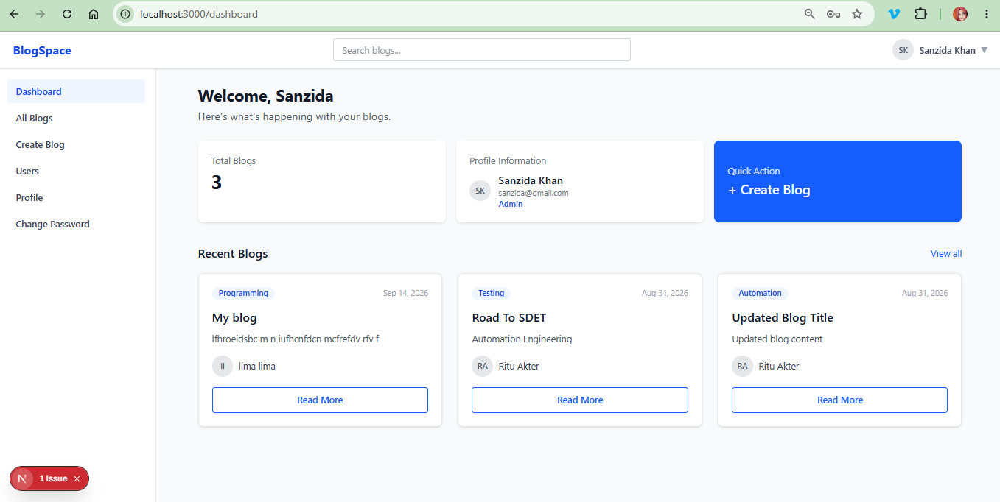
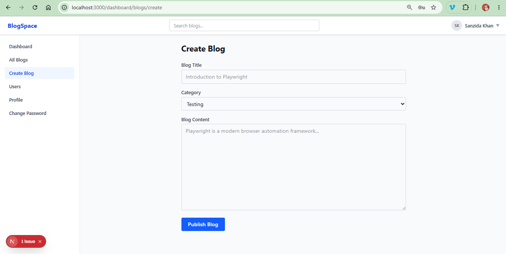
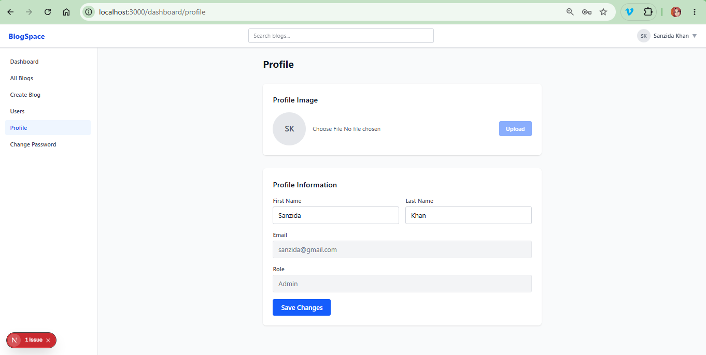
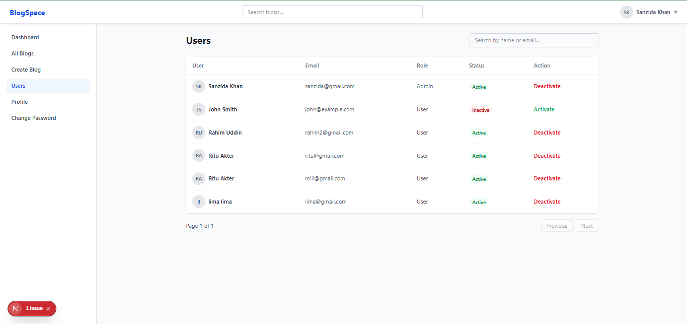

# Blog Management Application — Next.js + Express/MySQL

A full-stack blog platform built for **Assignment 2 (Batch 19 — Frontend Development)**: a Next.js (App Router) frontend consuming a real Express + MySQL Blog REST API, with three visitor types — Guest, User and Admin.

| Folder | What it is | Runs on |
|---|---|---|
| [`backend/`](backend/) | Express + Sequelize + MySQL API — auth, users, blogs, JWT, roles, file uploads, Swagger docs | `http://localhost:5000` |
| [`frontend/`](frontend/) | The Blog Management Application itself | `http://localhost:3000` |
| [`learn-nextjs/`](learn-nextjs/) | Standalone Next.js practice pages, unrelated to the assignment | `http://localhost:3001` |

All blog/user data in the frontend comes from the backend API — there is no mock data, no hardcoded users or blogs, and no direct database access from the frontend.

---

## 1. Project Overview

Guests can browse, search and filter blogs and read them without an account. Registering and logging in unlocks a personal dashboard where a user manages their own blogs and profile. Admins get the same dashboard plus user management (activate/deactivate accounts) and full control over every blog, not just their own.

## 2. Main Features

**Guest**
- Browse all blogs, search by title, filter by category (combinable)
- Read a full blog post with author info

**User** (everything a guest can do, plus)
- Register / Login / Logout, forgot & reset password
- Dashboard with quick stats and recent blogs
- Create / edit / delete their own blogs
- View and edit profile (first/last name), upload a profile photo
- Change password

**Admin** (everything a user can do, plus)
- View, edit and delete **any** blog
- View all registered users, view one user's details
- Activate / deactivate user accounts

**Cross-cutting**
- JWT-based auth, persisted across page refresh
- Route protection (redirect to `/login`) and role-based access (`/admin/*`), enforced by the backend regardless of what the UI hides
- Loading states, empty states, confirmation dialogs, and readable error messages everywhere

## 3. Technologies

- **Frontend:** Next.js 16 (App Router), React 19, Tailwind CSS v4, Axios
- **Backend:** Node.js, Express, Sequelize, MySQL, JWT, bcrypt, multer, Nodemailer, Swagger

---

## 4. Installation

### Prerequisites
- Node.js 20.9+ and npm
- A running MySQL server (5.7+ or 8.x)

### Backend

```bash
cd backend
npm install
cp .env.example .env      # Windows: copy .env.example .env
```

Edit `backend/.env` and set your MySQL password:

```ini
PORT=5000
DB_HOST=localhost
DB_PORT=3306
DB_USER=root
DB_PASSWORD=your_db_password
DB_NAME=blogdb
SECRET_KEY=change-this-to-a-long-random-secret
GMAIL=your_gmail_address@gmail.com
GMAIL_APP_PASSWORD=your_gmail_app_password
FRONTEND_URL=http://localhost:3000
```

`GMAIL` / `GMAIL_APP_PASSWORD` are only needed to actually send the registration and password-reset emails; the API still works without them (email sending fails silently/logs an error, the reset link is still created).

```bash
npm run seed     # creates admin@test.com / 1234
npm run dev      # → http://localhost:5000
```

The database and `users`/`blogs`/`password_resets` tables are created automatically on first start.

### Frontend

Open a second terminal:

```bash
cd frontend
npm install
cp .env.example .env.local     # Windows: copy .env.example .env.local
npm run dev      # → http://localhost:3000
```

`.env.local` (git-ignored):

```ini
NEXT_PUBLIC_API_URL=http://localhost:5000/api
```

---

## 5. Environment Variables

| Variable | Where | Purpose |
|---|---|---|
| `PORT` | backend | Port the API listens on |
| `DB_HOST`, `DB_PORT`, `DB_USER`, `DB_PASSWORD`, `DB_NAME` | backend | MySQL connection |
| `SECRET_KEY` | backend | Token signing (JWT expiry is fixed at `1d`) |
| `GMAIL`, `GMAIL_APP_PASSWORD` | backend | Sends welcome / password-reset emails |
| `FRONTEND_URL` | backend | Base URL used to build the password-reset link |
| `NEXT_PUBLIC_API_URL` | frontend | Base URL the frontend calls for the API |

Real `.env` files are never committed — only `.env.example` is.

---

## 6. Running the Application

```bash
# terminal 1
cd backend && npm run dev      # http://localhost:5000

# terminal 2
cd frontend && npm run dev     # http://localhost:3000
```

Seed login: `admin@test.com` / `1234` (role: admin). Register a normal account from `/register`.

---

## 7. Backend Dependency

The frontend has no data of its own — every page listed below is backed by a call to the Express API described in [`backend/`](backend/). If the backend is not running, pages show a "Cannot reach the server" message instead of failing silently.

---

## 8. Application Routes

| Route | Access | Purpose |
|---|---|---|
| `/` | Public | Browse / search / filter blogs |
| `/blogs/[id]` | Public | Blog details |
| `/login` | Public | Login |
| `/register` | Public | Registration |
| `/forgot-password` | Public | Request a password reset link |
| `/reset-password/[token]` | Public | Set a new password from the emailed link |
| `/dashboard` | User/Admin | Overview + stats |
| `/dashboard/blogs` | User/Admin | Manage blogs (own, or all for admin) |
| `/dashboard/blogs/create` | User/Admin | Create a blog |
| `/dashboard/blogs/[id]/edit` | User/Admin | Edit a blog (owner or admin) |
| `/dashboard/profile` | User/Admin | View/edit profile, upload avatar |
| `/dashboard/change-password` | User/Admin | Change password |
| `/admin/users` | Admin only | List and activate/deactivate users |
| `/admin/users/[id]` | Admin only | One user's details |

## 9. User / Admin Functionality

See "Main Features" above — the short version: a **user** owns their blogs and profile; an **admin** owns every blog and every user account, on top of their own.

## 10. Screenshots

**Home**


**Login**


**Register**


**Blog Details**


**Dashboard**


**Create Blog**


**Profile**


**Admin Users**


---

## 11. Backend API Reference

Base URL `http://localhost:5000`. Every response is `{ success, message, data }`. Protected routes require `Authorization: Bearer <token>`.

| Method | Endpoint | Access | Purpose |
|---|---|---|---|
| `POST` | `/api/auth/register` | anyone | Register (always role `user`) |
| `POST` | `/api/auth/login` | anyone | Log in, get a JWT |
| `POST` | `/api/auth/forgot-password` | anyone | Email a reset link |
| `PATCH` | `/api/auth/reset-password/:token` | anyone (with token) | Set a new password |
| `GET` | `/api/users` | admin | List users (`?page=&limit=&search=`) |
| `GET` | `/api/users/:id` | admin | One user's details |
| `PATCH` | `/api/users/:id/status` | admin | Activate/deactivate a user |
| `GET` | `/api/users/profile` | logged in | My own profile |
| `PUT` | `/api/users/profile/update` | logged in | Edit my own first/last name |
| `PATCH` | `/api/users/profile/image` | logged in | Upload my own avatar (`multipart/form-data`, field `image`) |
| `PATCH` | `/api/users/password` | logged in | Change my own password |
| `GET` | `/api/blogs` | anyone | List/search/filter blogs (`?title=&category=&page=&limit=`) |
| `GET` | `/api/blogs/mine` | logged in | My own blogs |
| `GET` | `/api/blogs/:id` | anyone | One blog |
| `POST` | `/api/blogs/create` | logged in | Create a blog (author taken from the token) |
| `PUT` | `/api/blogs/update/:id` | owner or admin | Update a blog |
| `DELETE` | `/api/blogs/delete/:id` | owner or admin | Delete a blog |

Explore interactively at <http://localhost:5000/swagger>.

---

## 12. Project Layout

```
learn-nextjs-b19-Assignment/
├── backend/
│   ├── config/         db connection, swagger
│   ├── controllers/    HTTP layer
│   ├── middlewares/    auth, admin, uploads, error handling
│   ├── models/         User, Blog, PasswordReset
│   ├── routes/         URL → controller mapping
│   ├── services/       business logic + queries
│   └── uploads/        uploaded avatars (git-ignored)
├── frontend/
│   ├── app/
│   │   ├── (public)/     home, blog details, login, register, forgot/reset password
│   │   └── (app)/        dashboard + admin, behind auth (and admin) guards
│   ├── components/       Navbar, Sidebar, ProfileMenu, BlogCard, BlogForm, ...
│   ├── contexts/         AuthContext (auth state, login/logout)
│   ├── services/         auth/user/blog API wrappers
│   └── lib/              axios instance, photo validation rules
└── learn-nextjs/          unrelated practice pages
```

---

## 13. Restrictions Honored

- No fake/mock blog or user data — everything comes from the API
- `userId` is never sent from the frontend when creating a blog; the backend takes it from the JWT
- Role, and account active/inactive status, can only be changed through admin-only backend routes — never from the frontend directly by a normal user
- All 401/403 responses from the backend are surfaced as readable messages, not ignored
